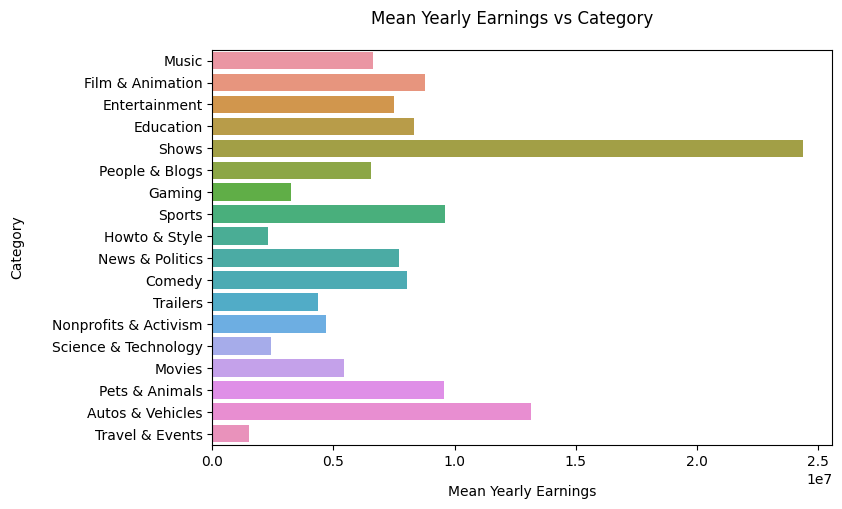
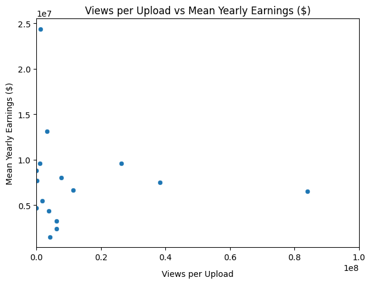
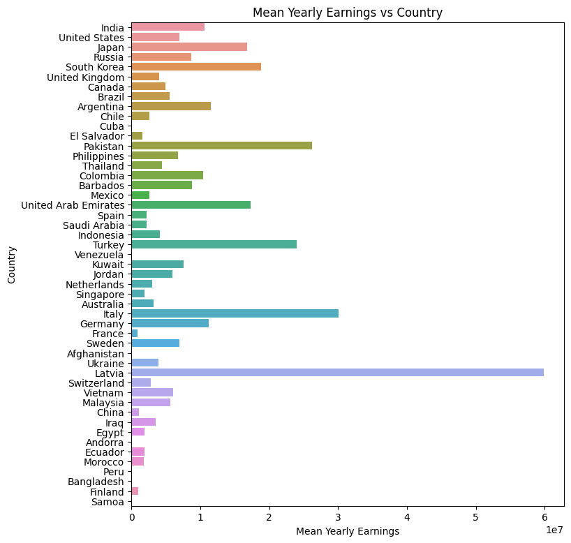

# Seaborn Visualization
The idea was to visualize the dataset in a range of different ways. However, this YouTube data proved to be difficult to present using various plot types. This is why I chose to visualize the dataset using techniques from the Seaborn documentation.

There was an issue with encoding the dataset, so I tackled it in the following manner:
```Python
youtube_filepath = "Global YouTube Statistics.csv"

encodings_to_try = ['utf-8', 'latin-1', 'ISO-8859-1']

for encoding in encodings_to_try:
    try:
        youtube_data = pd.read_csv(youtube_filepath, encoding=encoding)
        print("Successfuly read the file with encoding: " + encoding)
        break
    except UnicodeDecodeError:
        print("Failed to read the file with: " + encoding)
```
The output was:
> Failed to read the file with: utf-8
> Successfuly read the file with encoding: latin-1

The result indicated which encoding standard I needed to use:
```Python
youtube_data = pd.read_csv(youtube_filepath, encoding="latin-1")
```
## Visualization
```Python
g = sns.displot(
    data=youtube_data,
    y = "category", x = "subscribers"
)
g.set_axis_labels("Subscribers", "Category", labelpad=10)
g.figure.set_size_inches(7, 5)
g.despine(trim=True)

plt.subplots_adjust(top=0.9)
plt.suptitle("Subscribers vs Category", fontsize=12)
plt.show()
```
.png)

```Python
g = sns.catplot(data=youtube_data, y="category", x="subscribers", kind="violin")
g.set_axis_labels("Subscribers", "Category", labelpad=10)
g.figure.set_size_inches(7, 5)
g.despine(trim=True)

plt.subplots_adjust(top=0.9)
plt.suptitle("Subscribers vs Category", fontsize=12)
plt.xlim(0, 250000000)
plt.show()
```
.png)

```Python
youtube_data["mean_yearly_earnings_by_category"] = youtube_data.groupby("category")["highest_yearly_earnings"].transform("mean")
unique = youtube_data.drop_duplicates(subset="category")
unique['mean_yearly_earnings_by_category'] = unique['mean_yearly_earnings_by_category'].apply(lambda x: f'{x:.2f}' if not pd.isnull(x) else 'N/A')

unique = unique[~unique["category"].isnull()]

unique["mean_yearly_earnings_by_category"]=unique["mean_yearly_earnings_by_category"].astype('float')

g = sns.barplot(data=unique, x = "mean_yearly_earnings_by_category", y="category")
g.set_xlabel("Mean Yearly Earnings")
g.set_ylabel("Category")
g.figure.set_size_inches(8, 5)
plt.subplots_adjust(top=0.9)
plt.suptitle("Mean Yearly Earnings vs Category")
plt.show()
```


```Python
youtube_data["views_per_upload"] = youtube_data["video views"] / youtube_data["uploads"]
youtube_data["mean_yearly_earnings_by_category"] = unique["mean_yearly_earnings_by_category"]

g = sns.scatterplot(x="views_per_upload", y="mean_yearly_earnings_by_category", data = youtube_data)
g.set_xlabel("Views per Upload", labelpad=10)
g.set_ylabel("Mean Yearly Earnings ($)")
g.figure.set_size_inches(7, 5)
plt.title("Views per Upload vs Mean Yearly Earnings ($)")
plt.xlim(0, 100000000)
plt.show()
```


```Python
youtube_data["mean_yearly_earnings_by_country"] = youtube_data.groupby("Country")["highest_yearly_earnings"].transform("mean")
by_country = youtube_data.drop_duplicates(subset="mean_yearly_earnings_by_country")
youtube_data["mean_yearly_earnings_by_ccountry"] = by_country["mean_yearly_earnings_by_country"]

g = sns.barplot(data=youtube_data, x="mean_yearly_earnings_by_country", y="Country")
g.set_xlabel("Mean Yearly Earnings")
g.set_ylabel("Country")
g.figure.set_size_inches(8, 9)
plt.title("Mean Yearly Earnings vs Country")
plt.show()
```

